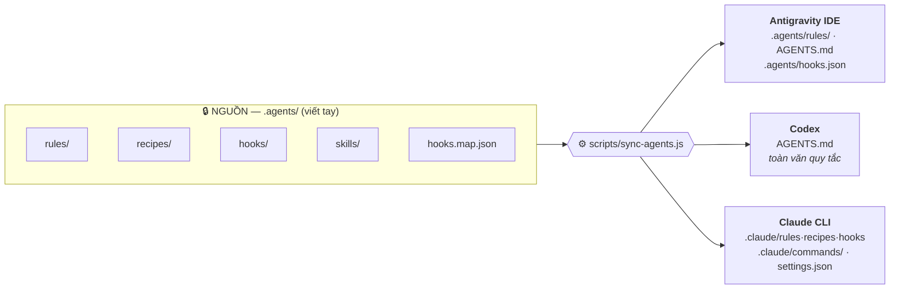

<div align="center">

# 🌐 UniversalAgent

### Một bộ quy tắc. Ba nền tảng AI. Không một bản sao viết tay nào.

**Bộ khung vận hành (operating framework) chuẩn hoá cho AI Agent.**
Viết quy tắc **một lần** tại `.agents/` — mọi cấu hình còn lại đều được **sinh ra**.

[](https://github.com/hieu180704/UniversalAgent/actions/workflows/drift-check.yml)


[**⚡ Cài đặt**](#-cài-đặt) · [**🔄 Kiến trúc một nguồn**](#-một-nguồn-mọi-nền-tảng) · [**🛠 Lệnh slash**](#-hệ-thống-lệnh-slash--meta-skills) · [**🛡 Guardrails**](#-guardrails-hooks--permissions)

</div>

---

## 📖 Mục lục

1. [Giới thiệu](#-giới-thiệu)
2. [Triết lý Cốt lõi](#-triết-lý-cốt-lõi)
3. [Yêu cầu Trước khi Cài](#-yêu-cầu-trước-khi-cài)
4. [Cài đặt](#-cài-đặt)
5. [Cấu trúc Hệ thống](#-cấu-trúc-hệ-thống)
6. [Một Nguồn, Mọi Nền tảng](#-một-nguồn-mọi-nền-tảng)
7. [Ba Lớp Chống Trôi Lệch](#-ba-lớp-chống-trôi-lệch-drift)
8. [Áp dụng cho Mọi Lĩnh vực](#-áp-dụng-cho-mọi-lĩnh-vực)
9. [Hệ thống Lệnh Slash & Meta-Skills](#-hệ-thống-lệnh-slash--meta-skills)
10. [Guardrails: Hooks & Permissions](#-guardrails-hooks--permissions)

---

## 🌟 Giới thiệu

Khi làm việc cặp với AI agent qua nhiều công cụ khác nhau, bộ quy tắc vận hành bị **chép tay lặp lại cho từng nền tảng**. Mỗi lần sửa quy tắc là một lần phải nhớ sửa ở N chỗ — và luôn quên ít nhất một chỗ.

**UniversalAgent** giải bài toán đó bằng đúng một nguyên tắc:

> Quy tắc viết **một lần** tại `.agents/`. Mọi thứ khác mang nội dung quy tắc đều là **sản phẩm của bộ sinh**, không phải bản chép tay.

Cài hôm nay bằng Claude CLI, vài tháng sau mở lại bằng Codex hay Antigravity — vẫn đúng bộ quy tắc đó, không phải chép lại lần nào. Và khung này **không chỉ dành cho lập trình**: sáng tác, quản trị, nghiên cứu đều dùng chung một quy trình.

---

## 🧠 Triết lý Cốt lõi

<table>
<tr>
<td width="50%" valign="top">

**🔁 Quy trình 4 pha bắt buộc**

`Explore → Propose → Confirm → Execute`
Dừng ở Propose đợi xác nhận, không tự nhảy pha.

</td>
<td width="50%" valign="top">

**🎯 Root-Cause & First-Principles**

Giải quyết tận gốc, không đoán mò, không vá triệu chứng, phản biện thẳng khi thấy rủi ro.

</td>
</tr>
<tr>
<td width="50%" valign="top">

**📚 Living Docs Engine**

`Docs/` là nguồn chân lý duy nhất, cập nhật song song với thực tế — không để tài liệu lỗi thời.

</td>
<td width="50%" valign="top">

**🪙 Tiết kiệm Token**

Điều hướng 2 tầng qua Knowledge Graph Node-0, chỉ đọc trúng đích thay vì quét cả workspace.

</td>
</tr>
</table>

---

## 📋 Yêu cầu Trước khi Cài

| Thành phần | Bắt buộc? | Vì sao |
| :--- | :---: | :--- |
| **Node.js** | ✅ | Bộ sinh cấu hình và toàn bộ hooks đều chạy bằng Node. Không có Node thì hooks im lặng không chạy. |
| **Git** | ⬜ | Chỉ cần cho hook nhắc Living Docs khi commit và cho lệnh `/worktree`. |
| **PowerShell 5.1+** | ⬜ | Chỉ trên Windows — đã có sẵn trong hệ điều hành. |

> Khung **không có dependency nào**: không `package.json`, không `npm install`. Node trần là đủ.

---

## ⚡ Cài đặt

Thư mục `UniversalAgent/` đóng vai trò **bộ cài**: giữ nó ở một chỗ cố định trên máy, rồi dùng chính nó cài cho bao nhiêu dự án khác tuỳ ý. **Không cần clone lại cho từng dự án.**

### Bước 1 — Lấy bộ khung về máy *(làm một lần duy nhất)*

```bash
git clone https://github.com/hieu180704/UniversalAgent.git
```

Hoặc tải ZIP rồi giải nén — ví dụ đặt tại `D:\Tools\UniversalAgent`.

### Bước 2 — Chạy installer, trỏ vào dự án đích

<table>
<tr><th align="left" width="40%">Windows — 1 click</th><th align="left" width="60%">Terminal</th></tr>
<tr valign="top">
<td>

**Kéo & thả** thư mục dự án đích vào `setup.bat`

*hoặc*

**Click đúp** `setup.bat` rồi dán đường dẫn khi được hỏi.

</td>
<td>

```powershell
# Windows
.\install.ps1 -TargetDir "D:\Project\GameCuaToi"
```

```bash
# macOS & Linux
./install.sh ~/project/game-cua-toi
```

</td>
</tr>
</table>

Thư mục đích **chưa tồn tại** thì installer tự tạo. Dự án **đã có code sẵn** cũng chạy được — installer merge vào, không xoá gì và không đụng tới mã nguồn của bạn.

Installer làm 3 việc: chép khung cấu hình cho 3 nền tảng → dựng khung `Docs/` → chạy luôn `node scripts/sync-agents.js` ngay trên dự án đích. Thiếu Node.js thì hai việc đầu vẫn xong, việc thứ ba báo lỗi — cài Node rồi chạy tay lệnh đó là đủ.

### Bước 3 — Bật `permissions.deny`

> ⚠️ **Chỉ cần làm khi dự án đã có sẵn `.claude/settings.json`.** Chưa có thì bỏ qua — mọi thứ đã chạy sẵn.

Khối `hooks` **tự bật**: bước sinh cấu hình sẽ nối dây hook vào `.claude/settings.json` sẵn có của bạn, giữ nguyên mọi khoá khác và cả hook bạn tự viết.

Riêng `permissions.deny` thì không — đó là chính sách quyền của dự án bạn, khung không tự ý ghi vào. Mở `.claude/settings.json.universalagent` và merge khối `permissions.deny` sang file của bạn.

### Bước 4 — Mở dự án bằng AI và gõ `/init`

AI hỏi 3 câu (**tên & lĩnh vực dự án** · **mục tiêu cốt lõi** · **techstack và quy chuẩn riêng**), rồi tự điền `AGENTS.md` / `CLAUDE.md`, tạo `Docs/SourceOfTruth/overview.txt` và khai báo phân vùng tri thức.

### ✅ Kiểm tra cài đặt thành công

```bash
node scripts/sync-agents.js --check     # phải in ✅ và thoát với mã 0
```

Trong Claude CLI, gõ `/` phải thấy đủ **9 lệnh**:
`/init` · `/plan` · `/explain` · `/research` · `/verify` · `/doc` · `/newsession` · `/worktree` · `/system-cleanup`

<details>
<summary><b>🔄 Cập nhật khung về sau — cài đè lên cùng thư mục có an toàn không?</b></summary>

<br>

`git pull` trong thư mục `UniversalAgent/`, rồi chạy lại installer lên đúng dự án cũ. **Cài lại lên cùng thư mục là an toàn:**

- Installer **merge chứ không thay thế** — không tạo cấu trúc lồng nhau kiểu `.agents/.agents`.
- **Không ghi đè** `.gitignore`, `.gitattributes`, `.editorconfig`, `.claude/settings.json` sẵn có. Bản của khung chỉ được đặt cạnh dưới tên `<file>.universalagent` khi nội dung **thật sự khác**; giống nhau thì không sinh file thừa, và sidecar cũ còn sót cũng được dọn luôn.
- **Không mang tài liệu nội bộ của khung sang dự án bạn.** `Docs/` chỉ được dựng khung thư mục kèm các file `*-template.txt`. Worklog, decision memo, handoff mà UniversalAgent sinh ra trong lúc phát triển chính nó đều ở lại repo gốc. Bản installer cũ từng chép nhầm sang thì lần cài mới sẽ dọn — nhưng **chỉ dọn file trùng khít từng byte** với bản gốc; file bạn tự viết dù trùng tên vẫn giữ nguyên.
- **Ngoại lệ:** các file `*-template.txt` trong `Docs/` thuộc quyền sở hữu của khung nên **luôn được làm mới**. Cần template riêng thì đặt tên khác.
- Nội dung do `/init` điền vào `AGENTS.md` / `CLAUDE.md` nằm **ngoài** cặp marker `UA:RULES` nên không bao giờ bị đụng tới.

</details>

---

## 📂 Cấu trúc Hệ thống

> **Ký hiệu:** 🔒 = viết tay (nguồn) · ⚙️ = tự sinh, **không sửa trực tiếp**

```text
UniversalAgent/
├── .agents/                     # 🔒 NGUỒN DUY NHẤT — Antigravity đọc trực tiếp
│   ├── rules/                   # 🔒 4 quy tắc cốt lõi
│   ├── recipes/                 # 🔒 6 mẫu cấu trúc đầu ra
│   ├── hooks/                   # 🔒 3 mã nguồn hook
│   ├── skills/                  # 🔒 9 kỹ năng → slash command
│   ├── hooks.map.json           # 🔒 Khai báo nối dây hook cho mọi nền tảng
│   └── hooks.json               # ⚙️ Cấu hình hook định dạng Antigravity
│
├── .claude/                     #    Claude CLI
│   ├── rules|recipes|hooks/     # ⚙️ Gương 1-1 của .agents/
│   ├── commands/                # ⚙️ Sinh từ .agents/skills/
│   └── settings.json            # 🔒 permissions.deny · ⚙️ riêng khối "hooks"
│
├── .github/workflows/           # 🔒 CI drift-check (không đi theo installer)
├── AGENTS.md                    #    Antigravity + Codex — giữa marker là ⚙️ TOÀN VĂN rule
├── CLAUDE.md                    #    Claude CLI — giữa marker là ⚙️ BẢN ĐỒ CHỈ MỤC
├── AGENTS_TEMPLATE.md           # 🔒 Khung seed cho dự án mới
├── CLAUDE_TEMPLATE.md           # 🔒 Khung seed cho dự án mới
├── scripts/sync-agents.js       # 🔒 Bộ sinh cấu hình đa nền tảng
├── install.ps1 · install.sh · setup.bat
│
└── Docs/                        #    Living Docs — installer chỉ mang *-template.txt
    ├── SourceOfTruth/           #    Tri thức gốc, spec, bối cảnh
    ├── Decisions/               #    Nhật ký quyết định (ADR / Memos)
    ├── Handoffs/                #    Bàn giao phiên & bài học
    ├── QC/                      #    Checklist nghiệm thu
    ├── Done/                    #    Worklog fragments
    └── prompts/                 #    Prompt tái sử dụng nhanh
```

---

## 🔄 Một Nguồn, Mọi Nền tảng

Sửa bất kỳ file nào trong `.agents/`, rồi chạy:

```bash
node scripts/sync-agents.js
```



| Nền tảng | File đích | Nội dung |
| :--- | :--- | :--- |
| **Antigravity IDE** | `.agents/rules/` + `AGENTS.md` + `.agents/hooks.json` | nguồn + **toàn văn** quy tắc + nối dây hook |
| **Codex** | `AGENTS.md` | **toàn văn** quy tắc |
| **Claude CLI** | `.claude/rules\|recipes\|hooks/` + `CLAUDE.md` + `.claude/settings.json` | gương + bản đồ chỉ mục + nối dây hook |

**Vì sao `AGENTS.md` khác `CLAUDE.md`** — đây là điểm dễ hiểu nhầm nhất. Claude CLI **tự nạp** `.claude/rules/` nên `CLAUDE.md` chỉ cần *bản đồ chỉ mục*. Antigravity đọc thẳng `.agents/rules/`. Nhưng **Codex chỉ nạp đúng `AGENTS.md`** và không tự mở thư mục rules — nên file này buộc phải mang *toàn văn* quy tắc. Đánh đổi là system prompt dài hơn, nhưng hành xử của Codex mới đồng nhất với hai nền tảng còn lại.

**Nối dây hook cũng một nguồn.** Matcher nào gọi script nào được khai báo tại `.agents/hooks.map.json` — vì cú pháp matcher của hai nền tảng khác nhau về bản chất và không suy diễn tự động được. Với `.claude/settings.json`, bộ sinh **chỉ** thay các mục hook của khung (nhận diện qua chuỗi `.claude/hooks/`); `permissions`, các khoá khác và hook bạn tự viết đều giữ nguyên.

**Cơ chế marker.** Trong `AGENTS.md` và `CLAUDE.md`, bộ sinh chỉ ghi đè phần nằm giữa:

```html
<!-- UA:RULES:BEGIN -->   ...vùng tự sinh...   <!-- UA:RULES:END -->
```

Nội dung riêng của dự án (phần `/init` điền) nằm ngoài marker và **không bao giờ bị đụng tới**.

**Dọn file mồ côi.** Xoá một skill trong `.agents/skills/` thì `.claude/commands/<skill>.md` tương ứng bị gỡ theo. Command bạn tự viết (không mang dấu `UA:GENERATED`) không bao giờ bị dọn.

> ⚠️ `.claude/rules`, `.claude/recipes`, `.claude/hooks` là **thư mục gương** — nội dung do bộ sinh sở hữu hoàn toàn, file lạ đặt vào đó sẽ bị dọn.

---

## 🚧 Ba Lớp Chống Trôi Lệch (Drift)

```bash
node scripts/sync-agents.js --check
```

Không ghi gì, chỉ báo file nào đã lệch nguồn và thoát với **mã lỗi 1**. Bạn không cần nhớ chạy lệnh này — nó được gọi tự động ở **ba lớp có độ phủ tăng dần**:

| # | Cơ chế | Bắt được gì | Điểm mù |
| :---: | :--- | :--- | :--- |
| **1** | hook `closeout-trigger.js` | `git commit` chạy qua AI agent | commit từ Git GUI / IDE |
| **2** | `.git/hooks/pre-commit` | mọi đường commit **trên máy đó** | không được version → không theo `git clone` |
| **3** | `.github/workflows/drift-check.yml` | mọi push & pull request | — |

Ba lớp **bổ sung nhau chứ không thay thế nhau**. Lớp 3 là lớp duy nhất bảo vệ được PR đến từ máy khác.

Lớp 2 phải cài thủ công cho từng clone:

```sh
#!/bin/sh
# .git/hooks/pre-commit — nhớ chmod +x
node scripts/sync-agents.js --check || exit 1
```

---

## 🎯 Áp dụng cho Mọi Lĩnh vực

| Lĩnh vực | `Docs/SourceOfTruth/` | `Docs/Decisions/` | `Docs/QC/` | Recipes dùng |
| :--- | :--- | :--- | :--- | :--- |
| **✍️ Sáng tác & Viết truyện** | Hồ sơ nhân vật, bối cảnh, timeline | Hướng đi cốt truyện, số phận nhân vật | Kiểm tra mâu thuẫn lore, văn phong | `recipe-deliverable`<br/>`recipe-review-qc` |
| **💼 Quản trị & Văn phòng** | Quy trình chuẩn (SOP), mục tiêu | Quyết định chiến lược, biên bản họp | Checklist nghiệm thu | `recipe-plan`<br/>`recipe-decision-memo` |
| **🔍 Hỏi đáp & Nghiên cứu** | Tài liệu tham khảo, dữ liệu kiểm chứng | So sánh giả thuyết, ưu/nhược điểm | Fact-check | `recipe-synthesis`<br/>`recipe-analysis` |
| **💻 Kỹ thuật & Lập trình** | Kiến trúc hệ thống, API specs | Quyết định kiến trúc (ADR), trade-offs | Test cases, linter, review | `recipe-plan`<br/>`recipe-review-qc` |

---

## 🛠 Hệ thống Lệnh Slash & Meta-Skills

| Lệnh | Công dụng |
| :--- | :--- |
| `/init` | Khởi tạo dự án — phỏng vấn bối cảnh & dựng `SourceOfTruth` |
| `/plan` | Phân rã mục tiêu thành WBS, Milestones & DoD |
| `/explain` | Decision Memo 7 phần để chốt hướng đi |
| `/research` | Nghiên cứu chuyên sâu đa chiều, lập ma trận so sánh |
| `/verify` | Thẩm định chất lượng, rà soát mâu thuẫn logic, checklist |
| `/doc` | Đồng bộ tài liệu sống với thực tế mới nhất |
| `/newsession` | Đóng phiên, lưu worklog, sinh prompt bàn giao |
| `/worktree` | Git Worktree cho thử nghiệm độc lập |
| `/system-cleanup` | Dọn tệp rác, bản nháp trùng lặp, dữ liệu thừa |

Nguồn của các lệnh này là `.agents/skills/<tên>/SKILL.md`. Thêm một thư mục skill mới rồi chạy đồng bộ là Claude CLI có ngay slash command tương ứng.

---

## 🛡 Guardrails: Hooks & Permissions

Ba hook trong `.agents/hooks/` *(bản cho Claude CLI nằm ở `.claude/hooks/`)*:

| Hook | Sự kiện | Hành vi |
| :--- | :--- | :--- |
| 🔴 `safety-guard.js` | trước khi ghi/sửa file **và** trước khi chạy lệnh shell | **Chặn cứng** thao tác lên file bí mật: biến môi trường, `*.pem`, `id_rsa*`, `credentials.json`, `secrets/` |
| 🟡 `read-guard.js` | trước khi đọc file | Cảnh báo khi đọc file nhị phân/media — **advisory, không chặn** |
| 🟢 `closeout-trigger.js` | trước `git commit` | Nhắc Living Docs (chỉ khi commit không đụng `Docs/`) **và** chạy `--check` để bắt file tự sinh đã lệch nguồn |

Hook đọc payload JSON qua **stdin** (Claude CLI) và có fallback **`argv[2]`** (Antigravity) nên một file chạy được cả hai nền tảng.

<details>
<summary><b>🔬 Vì sao <code>safety-guard.js</code> dùng hai bộ pattern tách biệt</b></summary>

<br>

- **Đường dẫn file** — so khớp trên toàn bộ chuỗi. Dấu `\` của Windows được chuẩn hoá về `/` trước khi so; thiếu bước này thì mọi pattern đều trượt trên đường dẫn Windows và hook trở thành vô dụng.
- **Chuỗi lệnh shell** — tách token trước rồi mới so khớp, với bộ pattern hẹp hơn. Nhờ vậy `cat` hay `curl --data-binary @` nhắm vào file bí mật thì bị chặn, còn `grep -rn "secrets" .` và `git commit -m "..."` thì **không** bị chặn oan.

**Đánh đổi còn lại:** một lệnh chỉ *chứa* chuỗi trùng khít tên file nhạy cảm vẫn bị chặn oan — kể cả khi nó chỉ đang ghi tài liệu. Gặp trường hợp đó thì sửa tay, hoặc gỡ pattern tương ứng trong `.agents/hooks/safety-guard.js`.

</details>

> ⚠️ **Codex chưa có cơ chế lifecycle hook**, nên lớp guardrails tự động này chỉ có hiệu lực trên **Antigravity** và **Claude CLI**. Chạy bằng Codex thì quy tắc an toàn vẫn nằm trong rule text, nhưng không có chốt chặn cưỡng chế.

Riêng Claude CLI còn có **lớp chặn thật ở tầng harness**: `permissions.deny` trong `.claude/settings.json` khoá thẳng quyền đọc/ghi các file nhạy cảm và lệnh `rm -rf`, không phụ thuộc vào hook.

> ⚠️ Sửa `.claude/settings.json` xong phải **khởi động lại phiên** Claude CLI thì cấu hình hook mới được nạp.

---

<div align="center">
<sub>

**UniversalAgent** — *Correct · Minimal · Verifiable*

Tri thức gốc của chính khung này nằm tại [`Docs/SourceOfTruth/overview.txt`](Docs/SourceOfTruth/overview.txt)

</sub>
</div>
